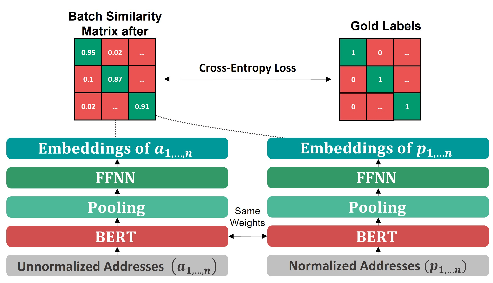

# ICMLA-2023
This is the official code accompanied with the paper 'Improving embeddings for high-accuracy transformer-based address matching using a multiple in-batch negatives loss'.  The paper is submitted to ICMLA 2023.

  

Fig. 1: Fine-tuning architecture of bi-encoder for the address matching task model when using multiple negative ranking loss

